# 开发指南


## IDE eclipse-php-luna

1. 安装svn插件
2. 安装vi支持插件
3. 配置编码和换行
4. 设置精典主题
5. 设置自动提示延时
6. 设置字体
7. 设置volt模板类型
8. 空格代替TAB，显示空白符
9. 格式化标准为PSR-2
10. 设置xdebug支持跟踪调试

```
自动换行可以参考 Eclipse Word Wrap
https://github.com/ahtik/eclipse-wordwrap/wiki
Use http://ahtik.com/eclipse-update/ update site to install the latest version.
Go to http://ahtik.com/blog/projects/eclipse-word-wrap/ for more info
```

### 安装svn

http://subclipse.tigris.org/update_1.10.x

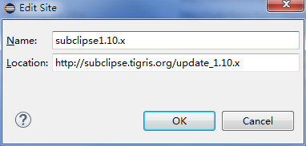

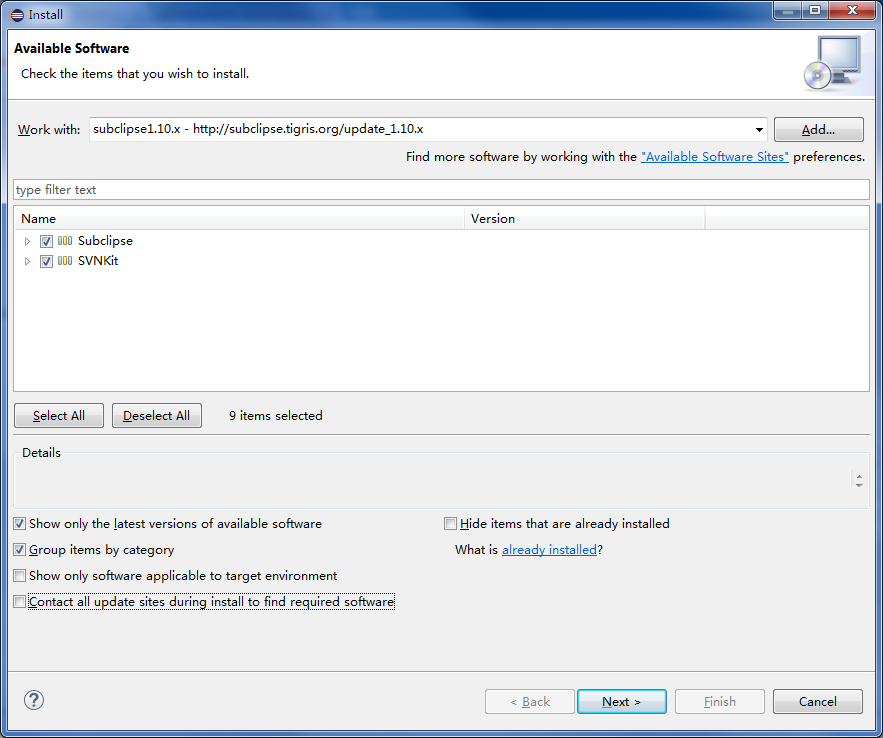

建议不要选择Contact all update sites during install to find required software

### 安装 Twig | Eclipse | Plugin

http://twig.dubture.com/installation/

除了通过marketplace安装外还可以如下

```
The plugin can be installed via the Update Manager using the following updatesite:
http://p2-dev.pdt-extensions.org
```

### vim-vrapper

http://vrapper.sourceforge.net/update-site/stable

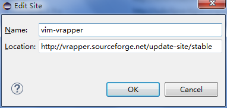

### 统一配置

编码
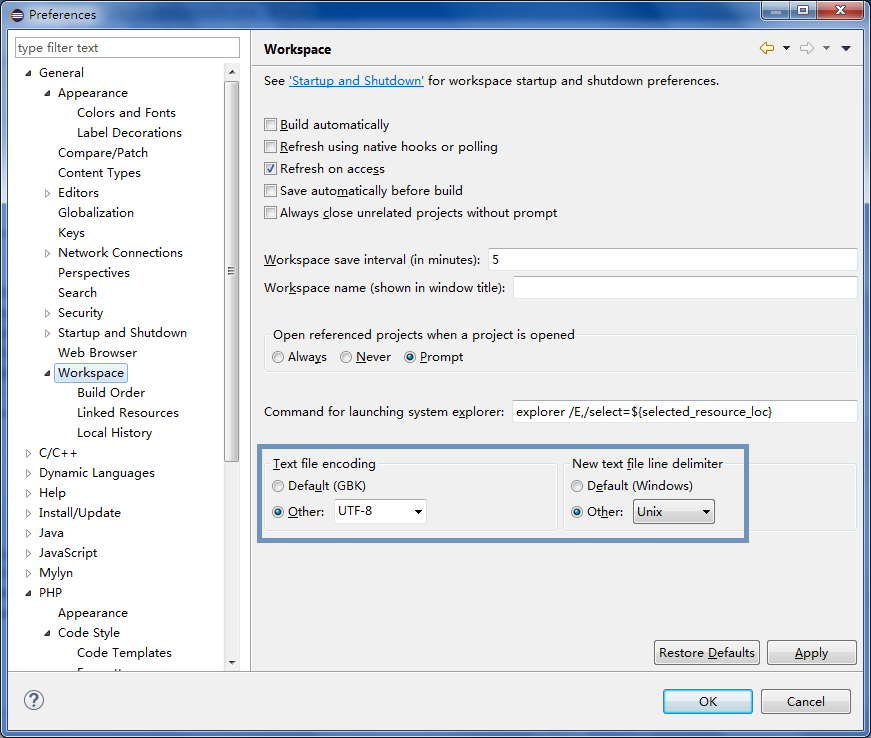

设置精典主题
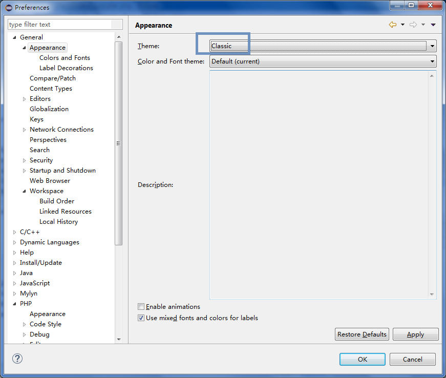

加快自动提示速度
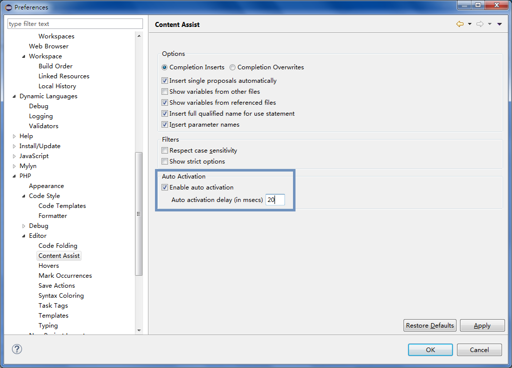

字体
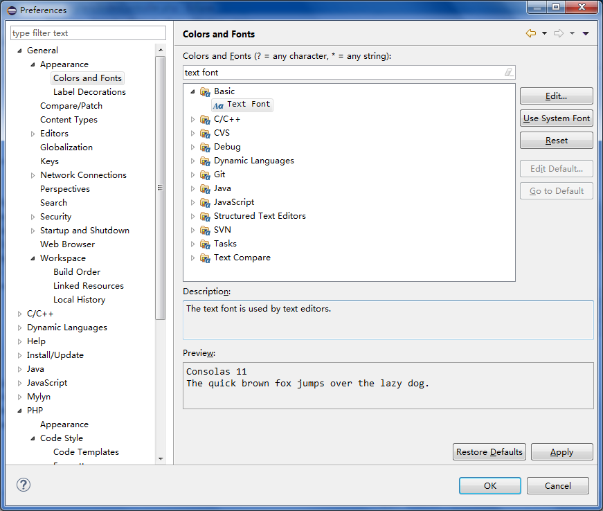

模板语法高亮显示
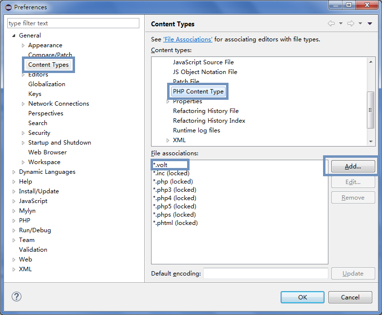


显示空白

空格代替tab

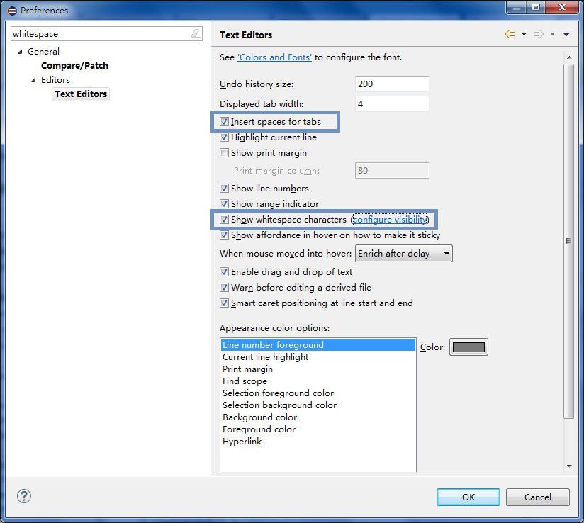

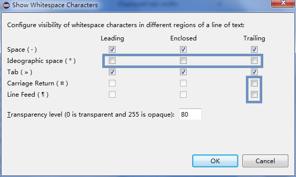

格式化标准为PSR-2

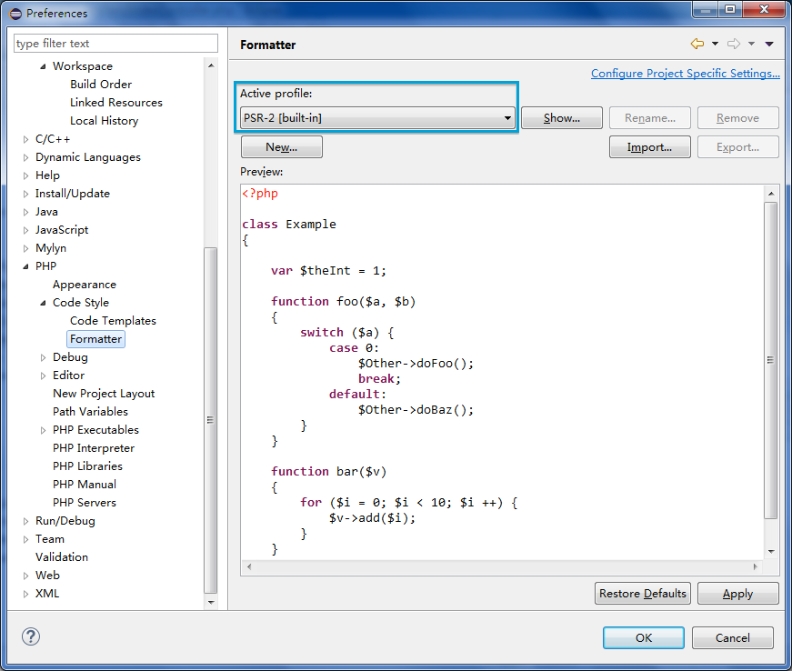

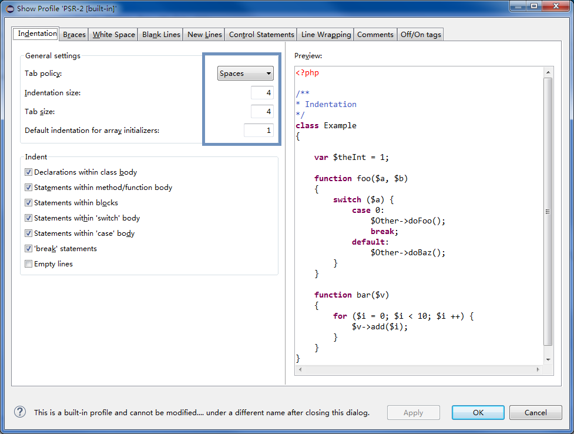

php调试

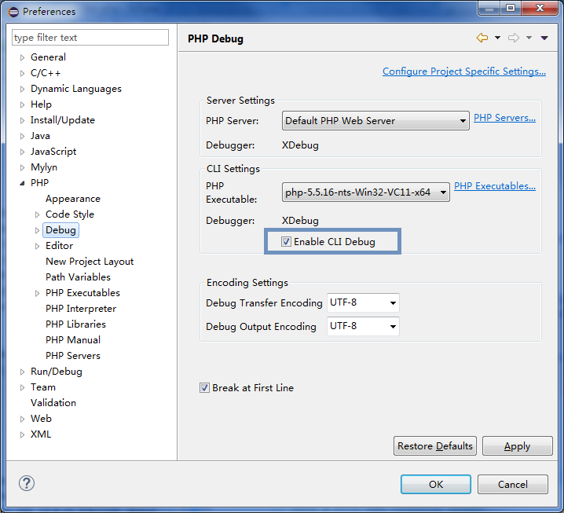

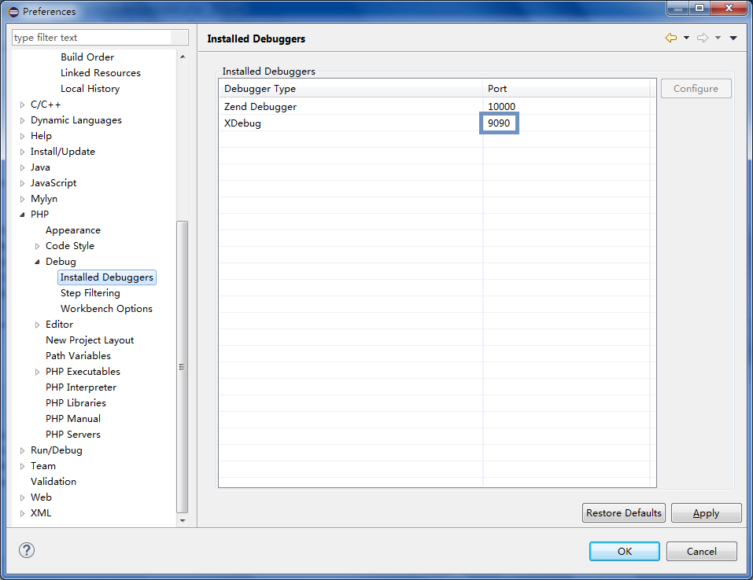

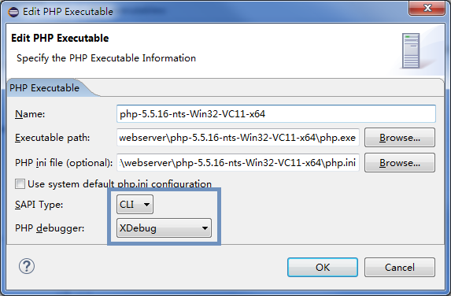

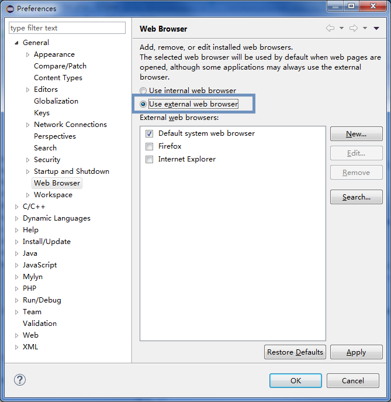

## eclipse基本使用指导

### workspace

### PHP项目

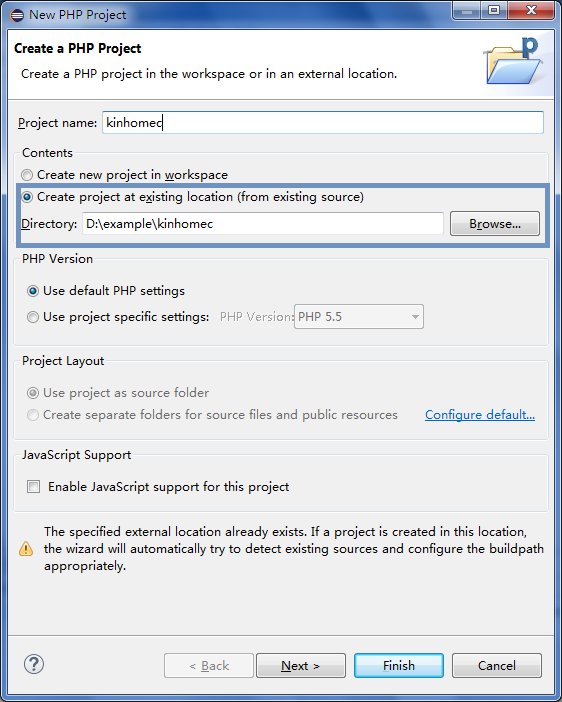

PHP Include Path

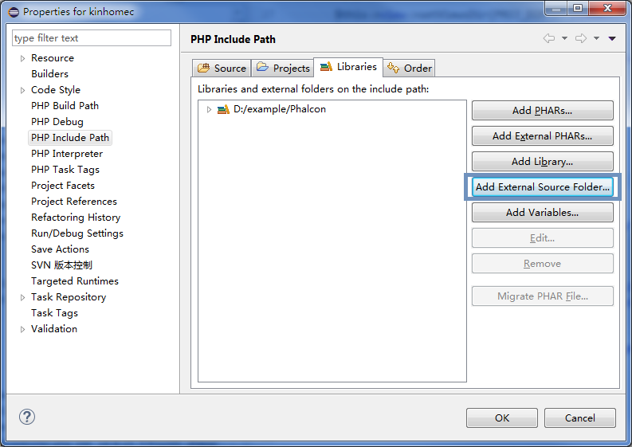

除了指定外部源码目录外还可以指定项目

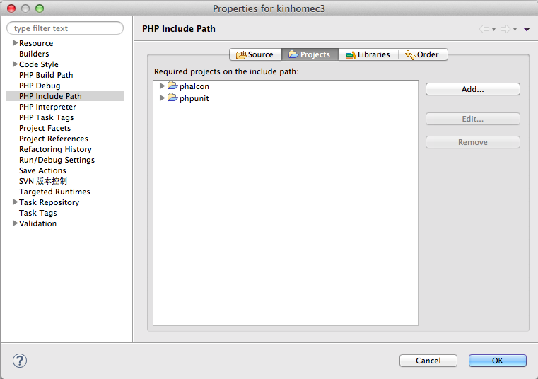

### 搜索，快速打开项目文件

- Ctrl+Shift+R
- Ctrl+h

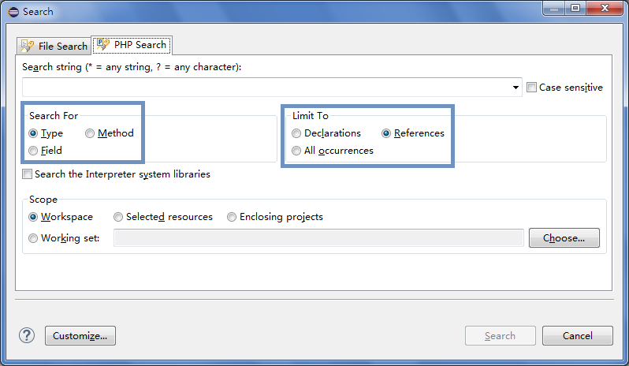


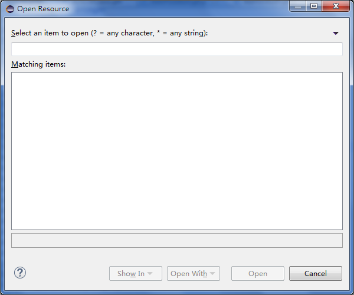

### 快捷键
* 显示快捷键：Ctrl+Shift+L
* 删除行：Ctrl+D
* 开关注释：Ctrl+/
* 块注释：Ctrl+Shift+/    Ctrl+Shift+\
* 跳转到行号：Ctrl+L
* 格式化文件：Ctrl+Shift+F
* 格式化选中部分：Ctrl+I
* 补全提示：Alt+/

### 分割窗口

windows->editor

### 本地历史记录

比较 Local history

替换 Local history

### 文档注释

- 编写规范
- 文档工具生成文档

兼容phpstorm,netbeans,eclipse的函数内变量注释

```
/* @var $var type */
```
### svn插件使用

## phalcon-devtools

## 单元测试

## 迭代进化

从需求到设计，迭代进化

#### 逻辑分层架构

#### 分析与设计

- 分析=调查研究≠解决方案
- 设计=概念上的解决方案≠实现

设计可实现、实现表达真实完整的设计。

1. 定义用例
2. 定义领域模型
3. 定义交互图
4. 定义设计类图

#### UML交互图与UML类图

1. 建模（构建UML草图......）的目的主要是为理解和沟通，而非文档。
2. 应该把时间花费在交互图（顺序图或通信图），而不仅是类图上。
3. 思考职责、角色、协作。

#### 软件架构支持技术（开发软件时要遵循的基本原则）
1. 抽象
2. 封装
3. 信息隐藏
4. 分离关注点
5. 耦合与内聚
6. 充分、完整、简单
7. 策略与实现分离
   - 策略组件负责上下文相关决策，解读信息的语义和含义，将众多不同结果合并或选择参数值
   - 实现组件负责执行定义完整的算法，不需要作出与上下文相关的决策。上下文和解释是外部的，通常由传递给组件的参数提供。
8. 接口与实现分离
   - 接口部分定义了组件提供的功能以及如何使用该组件。组件的客户端可以访问该接口。
   - 实现部分包含实现组件提供的功能的实际代码，还可能包含仅供组件内部使用的函数和数据结构。组件的客户端不能访问其实现部分。
9. 单个引用点
   - 软件系统中的任何元素都应只声明和定义一次，避免不一致性问题。
10. 分而治之

#### 软件架构的非功能特性
1. 可修改性
   - 可维护性
   - 可扩展性
   - 重组
   - 可移植性
2. 互操作性
   - 与其它系统或环境交互
3. 效率
4. 可靠性
   - 容错：发生错误时确保行为正确并自行修复
   - 健壮性：对应用程序进行保护，抵御错误的使用方式和无效输入，确保发生意外错误时处于指定状态。
5. 可测试性
6. 可重用性
   - 通过重用开发软件
   - 开发软件时考虑重用

## 安装本地PHP环境

- 下载合适的PHP版本：[http://windows.php.net/download](http://windows.php.net/download/ "")
- 安装扩展[http://windows.php.net/downloads/pecl/releases/](http://windows.php.net/downloads/pecl/releases/ "")
- 至少安装扩展 memcache,redis,xdebug
- 备用[http://windows.php.net/downloads/pecl/snaps](http://windows.php.net/downloads/pecl/snaps "")

## 共享+mount方式

### centos mount win7

在windows7 64位系统上建立共享目录，everyone 读写，
win7防火墙默认不允许跨网段共享、跨网段ping，可先关闭防火墙尝试成功后，再调节防火墙策略（入站规则，出站规则）。
```
参考设置
控制面板\网络和 Internet\网络和共享中心\高级共享设置
启用网络发现
启用文件和打印机共享
关闭公用文件夹共享（登录到此计算机的用户仍然可以访问这些文件）
为使用40或56位加密的设备启用文件共享
关闭密码保护共享
```

以ip为xxx共享目录为kinhomec,vendor为例，在linux系统上执行

```bash
# 第一次先安装文件共享工具
yum install cifs-utils

# 第一次先创建相关目录
mkdir -p /var/www/kinhomec
mkdir -p /var/www/vendor

# 若目录不为空，建议先清空目录

# 在win7中写代码，在Linux系统中运行，调试。
mount -o rw,dir_mode=0777,file_mode=0777 -t cifs //192.168.68.xxx/kinhomec /var/www/kinhomec
mount -o rw,dir_mode=0777,file_mode=0777 -t cifs //192.168.68.xxx/vendor /var/www/vendor
```

```bash
# 同样可以共享分支代码
mount -o rw,dir_mode=0777,file_mode=0777 -t cifs //192.168.68.207/jinhaima/branches/project_shipping_r1942 /var/www/jinhaima
```

修改hosts文件指向远程开发机，在win7上写代码，在centOS系统上运行。

```bash
#显示挂载信息
mount

#卸载
umount /var/www/kinhomec
umount /var/www/vendor
```

### centos mount osx

需要设置nounix,sec=ntlmssp

```bash
mount -t cifs //<server ip>/kinhomec /var/www/kinhomec -o username=xxxx,password=xxxx,nounix,sec=ntlmssp,noperm,rw

mount -t cifs //192.168.68.xxx/kinhomec /var/www/kinhomec -o rw,dir_mode=0777,file_mode=0777,username=xxxx,password=xxxx,nounix,sec=ntlmssp
mount -t cifs //192.168.68.xxx/vendor /var/www/vendor -o rw,dir_mode=0777,file_mode=0777,username=xxxx,password=xxxx,nounix,sec=ntlmssp
```

## 持续集成continuous integration

- [http://jenkins-php.org](http://jenkins-php.org)
- [https://www.phptesting.org](https://www.phptesting.org)
- [phing](http://www.phing.info)
- [xinc](https://code.google.com/p/xinc)

## 后续
- Vagrant
- apache+php
- windows共享+linux mount

